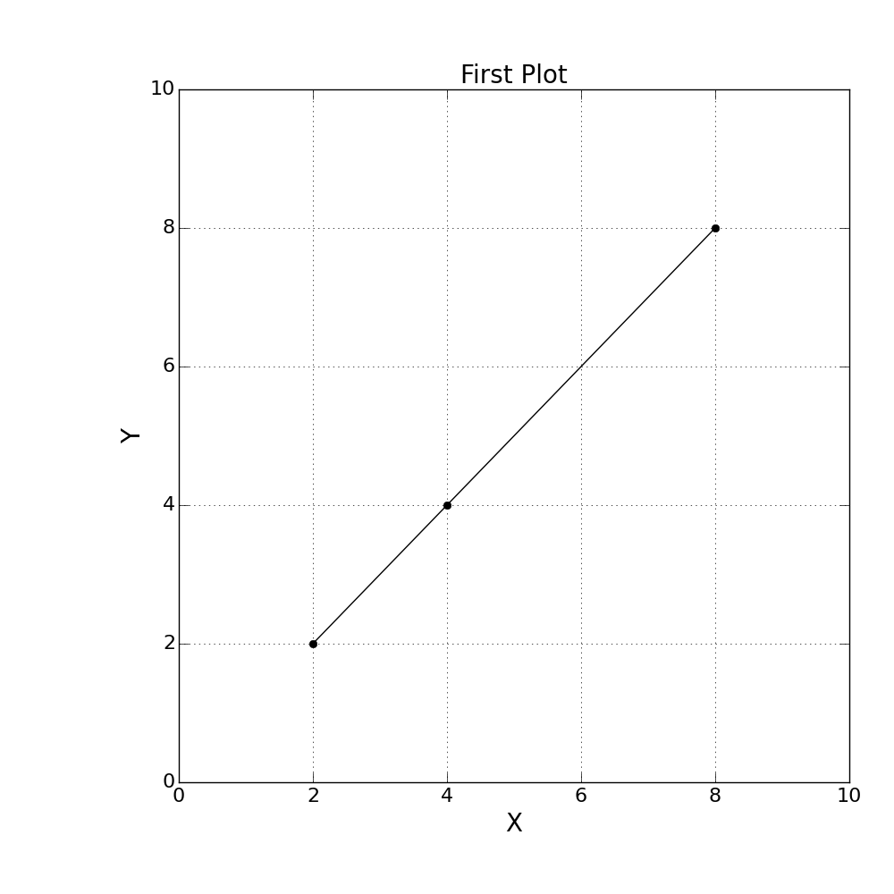
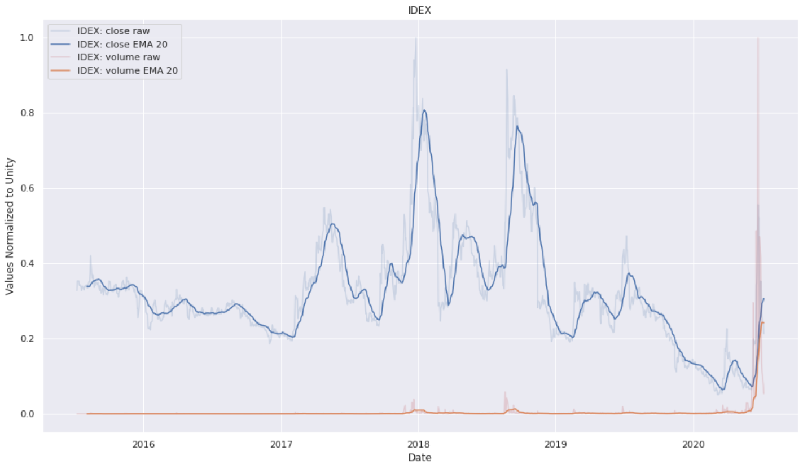

# Plotting in Python

----
### Line Plot

This figure was made using [LinePlot.py](LinePlot/LinePlot.py).



----
## Styles

### XKCD
There are many different plotting styles in python, from `seaborn` (professional), to `xkcd` (fun).<br>
The script [`xkcd_style.py`](./xkcd_style.py) shows how to plot using the xkcd style.  Setting this style, with the line:
```py
plt.xkcd()
```
allows you to make plots like the one shown here:


### Seaborn
Seaborn makes matplotlib a bit more professional looking.  While seaborn offers many tools, to add seaborn to an existing matplotlib plot, you only need two lines of code.
```py
import seaborn as sns
sns.set()
```
These two lines of code change the plotting style.  The script [`yahoo_finance.py`](./seaborn/yahoo_finance.py) uses seaborn to make the following plot:

