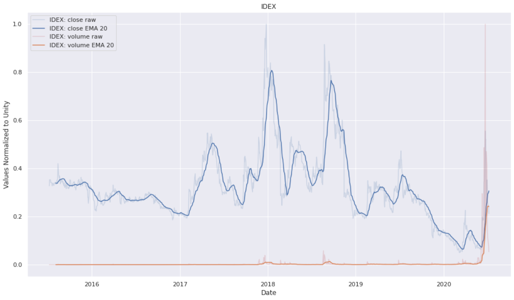
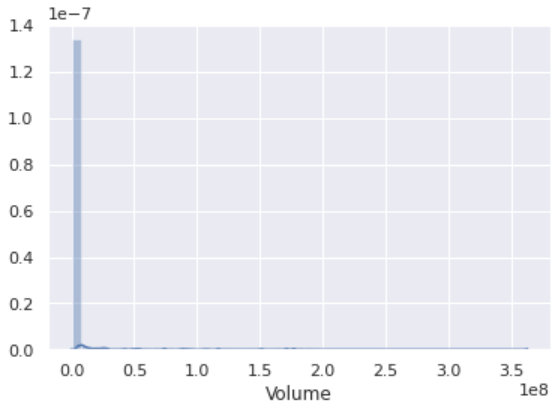

# Seaborn
Seaborn gives figures made by matplotlib a more modern/professional look.

Here are a few examples of plots made with seaborn.<br>
The script [`yahoo_finance.py`](./yahoo_finance.py) was used to make the following plot



Seaborn also offers features that matplotlib lacks, such as `sns.distplot()`.  This code snippet can be found in [`seaborn_example.py`.](./seaborn_example.py)
```py
from pandas_datareader import data
import matplotlib.pyplot as plt
import seaborn as sns
sns.set()
idex_vol = data.DataReader("IDEX", data_source='yahoo')['Volume']
sns.distplot(idex_vol)
```


----
### Other Seaborn Features Worth Noting

`pairplot` allows you to easily compare data parameters.
```py
sns.pairplot(df2, hue=df.columns[1], height=2.5)
```

`jointplot` allows you to visualize scatter plots and histograms simultaneously.  Histograms will appear on both axes.
```py
sns.jointplot(x=df.columns[0], y=df.columns[1], data=df)
```

`lmplot` generates a scatter-plot with linear regression automatically applied.
```py
sns.lmplot(x=df.columns[0], y=df.columns[1], data=df)
```

- box and whisker plots
- swarm plots
- `sns.countplot`: histograms broken down by category
- `sns.heatmap`